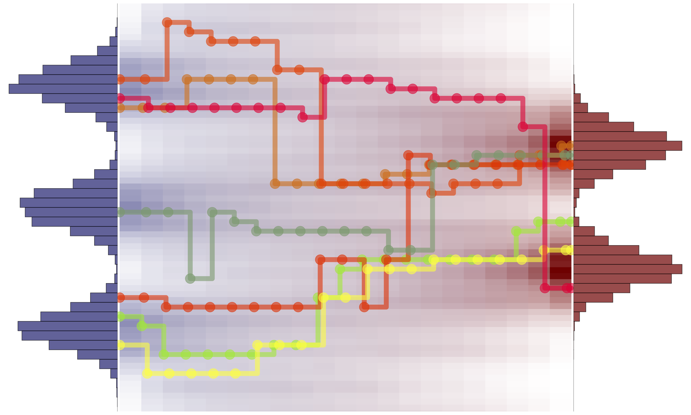

# Discrete Diffusion Samplers and Bridges: Off-Policy Algorithms and Applications in Latent Spaces

<p align="center">
      📃 <a href="https://arxiv.org/abs/2602.05961" target="_blank">Paper</a>  <br>
</p>

<p align="center">
  
</p>

---
> **Discrete Diffusion Samplers and Bridges: Off-Policy Algorithms and Applications in Latent Spaces**<br>
> Arran Carter*, Sanghyeok Choi*, Kirill Tamogashev*, Víctor Elvira, Nikolay Malkin<br>
\* - indicates equal contribution<br><br>
>**Abstract:**   Sampling from a distribution $p(x) \propto e^{-\mathcal{E}(x)}$ known up to a normalising constant is an important and challenging problem in statistics. Recent years have seen the rise of a new family of amortised sampling algorithms, commonly referred to as diffusion samplers, that enable fast and efficient sampling from an unnormalised density. Such algorithms have been widely studied for continuous-space sampling tasks; however, their application to problems in discrete space remains largely unexplored. Although some progress has been made in this area, discrete diffusion samplers do not take full advantage of ideas commonly used for continuous-space sampling. In this paper, we propose to bridge this gap by introducing off-policy training techniques for discrete diffusion samplers. We show that these techniques improve the performance of discrete samplers on both established and new synthetic benchmarks. Next, we generalise discrete diffusion samplers to the task of bridging between two arbitrary distributions, introducing data-to-energy Schrödinger bridge training for the discrete domain for the first time. Lastly, we showcase the application of the proposed diffusion samplers to data-free posterior sampling in the discrete latent spaces of image generative models.


## Project structure

```
discrete_samplers_and_bridges
├── algorithms/          # Scripts for the training of bridge/sampling algorithms
├── assets/              # Just figure1.png
├── configs/             # Hydra configuration files
│   ├── algorithm/       # Hydra configuration files for bridge/sampling algorithms
│   ├── model/           # Hydra configuration files for models
│   └── target/          # Hydra configuration files for target distributions
├── eval_metrics/        # Implementations of ELBO, EUBO, ESS, MMD, Sinkhorn, and metrics for Ising/Potts models
├── mcmcs/               # Implementations of MCMC samplers for off-policy training
├── models/              # Neural network definitions (MLP, ViT)
├── samplers/            # Core logic for bridge/sampling algorithms
├── targets/             # Target distributions to sample from
│   ├── cls/             # Cls model for the outsourced sampler on MNIST
│   ├── vae/             # VQVAE for the outsourced sampler on MNIST
│   ├── ...              # Other targets like GMM, Ising, Potts, etc.
├── tests/               # Unit tests
├── utils/               # Utils
├── losses.py            # Losses
├── buffers.py           # Replay buffers
├── run.py               # Main entry point for training/evaluation
├── README.md            # Project documentation and setup instructions
└── pyproject.toml       # Build system and dependency management
```
## Setup

We use `uv` to manage the project. Install it following the [instructions](https://docs.astral.sh/uv/getting-started/installation/).

Once installed, run the following command in the root of the project to install the dependencies:
```bash
uv sync
```

This will create `.venv` in the root of the project. To activate the environment, run:
```bash
source .venv/bin/activate
```
We recommend to set the environment variable `TORCH_COMPILE=1` to enable compilation.
It is also possible to set custom path for writable files using `WRITABLE_DIR=/your/writable/dir`

## Run the experiments
### Discrete samplers

To reproduce the results in table 1 & 2, run the following command:
```bash
python run.py seed=<seed> target=<target> algorithm=mcmc
python run.py seed=<seed> target=<target> algorithm=mdns
python run.py seed=<seed> target=<target> algorithm=logvar
python run.py seed=<seed> target=<target> algorithm=logvar_iwbuf
python run.py seed=<seed> target=<target> algorithm=logvar_iwbuf_mcmc
python run.py seed=<seed> target=<target> algorithm=tb
python run.py seed=<seed> target=<target> algorithm=tb_iwbuf
python run.py seed=<seed> target=<target> algorithm=tb_iwbuf_mcmc
```
for each seed `{0, 1, 2, 3, 4}` and target `{40gmm_2d, 40gmm_4d, manywell_4d, manywell_10d, ising_L16_critical, ising_L16_low, ising_L16_lower, potts_L16_critical, potts_L16_low}`.

### Discrete data-to-energy Schrödinger bridges
To run experiments on discrete data-to-energy Schrödinger bridges, run the following command:
```bash
python run.py target=<target> algorithm=bridge # on-policy data-to-energy SB
python run.py target=<target> algorithm=bridge_mcmc # off-policy data-to-energy SB
```
 Available targets include `sb_3gmm_to_4gmm`, `sb_3gmm_to_10gmm`, `sb_scruve_to_10gmm`, `sb_10gmm_to_40gmm`


### Discrete outsourced samplers on MNIST

To run experiments on discrete outsourced samplers on MNIST, run the following command:
```bash
python run.py target=mnist_posterior algorithm=logvar # MLP model
python run.py target=mnist_posterior_vit algorithm=logvar # ViT model
```
Target classes for these experiments can be configured in `configs/target/mnist_posterior.yaml` or by setting `target.target_class='[<class1>, <class2>, ...]'`

## Citation
Please, cite this work as:
```bibtex
@article{carter2025discrete,
  title  = {Discrete Diffusion Samplers and Bridges: Off-Policy Algorithms and Applications in Latent Spaces},
  author = {Carter, Arran and Choi, Sanghyeok and Tamogashev, Kirill and Elvira, Víctor and Malkin, Nikolay},
  year   = {2026},
  note   = {arXiv:2602.05961},
}
```


